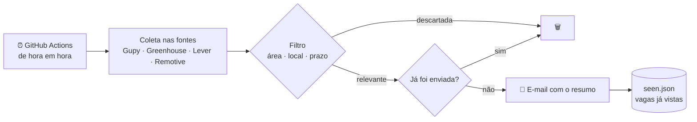

<div align="center">

# 🔎 vagas-estagio-bot

**Receba vagas de estágio em cibersegurança, redes e IA direto no seu e-mail, só quando aparecer novidade.**

[](https://github.com/ArthurRod-Ciber/bot-estagios/actions/workflows/vagas.yml)


</div>

---

## 📌 Sobre

Procurar estágio todo dia em vários sites cansa, e as boas vagas somem rápido.
Este bot faz isso por mim: **de hora em hora** ele consulta portais de vagas, filtra o que realmente combina com meu perfil e manda um **resumo por e-mail apenas quando surge algo novo**. Sem novidade, sem e-mail.

Roda 100% no **GitHub Actions**, sem servidor e sem precisar deixar o computador ligado.

## ✨ Funcionalidades

- 🌐 **Várias fontes:** Gupy (vagas brasileiras), Greenhouse e Lever (páginas oficiais de carreira) e Remotive (vagas remotas)
- 🎯 **Filtro inteligente:** área (segurança, redes, infra, IA), modalidade (remoto ou híbrido na minha cidade) e palavras de exclusão
- 🌎 **Checagem internacional:** só entram vagas remotas que aceitam candidatos no Brasil
- 📅 **Inscrições abertas:** descarta vagas com prazo vencido
- ⚠️ **Alertas automáticos** quando algo não está claro:
  - exigência de visto ou autorização de trabalho em outro país
  - período ou semestre mínimo do curso
  - requisitos não encontrados na descrição
  - link de agregador (confirmar na página oficial)
- 🧠 **Memória:** nunca envia a mesma vaga duas vezes
- 🛡️ **Tolerante a falhas:** se uma fonte cair, as outras continuam funcionando

## ⚙️ Como funciona



Cada vaga no e-mail traz **empresa, cargo, modalidade, local, requisitos, alertas e o link** para se candidatar.

## 🚀 Como usar

### 1. Faça um fork ou clone
```bash
git clone https://github.com/ArthurRod-Ciber/bot-estagios.git
cd bot-estagios
```

### 2. Crie uma senha de app do Gmail
Com a verificação em duas etapas ativada, gere uma senha em
👉 https://myaccount.google.com/apppasswords

> A senha de app só permite enviar e-mail e pode ser revogada a qualquer momento. Sua senha principal nunca fica exposta.

### 3. Cadastre os secrets
Em **Settings → Secrets and variables → Actions → New repository secret**:

| Secret | Valor |
|---|---|
| `SMTP_USER` | Gmail que envia |
| `SMTP_PASSWORD` | senha de app (16 caracteres, sem espaços) |
| `EMAIL_TO` | e-mail que recebe as vagas |

### 4. Ative o workflow
Aba **Actions → Buscar vagas de estágio → Run workflow**. A partir daí ele roda sozinho de hora em hora. ✅

> Se der erro de permissão ao salvar o estado: **Settings → Actions → General → Workflow permissions → Read and write**.

## 🎛️ Personalização

Tudo é configurado no [`config.yaml`](config.yaml), sem mexer no código:

```yaml
area:
  palavras_titulo: [segurança, cybersecurity, redes, infra, ti, ia]

local:
  cidades_hibrido_presencial: [uberlândia]
  incluir_presencial: false

fontes:
  greenhouse:
    empresas: [cloudflare, gitlab, nubank]   # adicione empresas aqui
```

> 💡 Para acompanhar uma empresa, veja se a página de vagas dela é `boards.greenhouse.io/NOME` ou `jobs.lever.co/NOME` e adicione o `NOME` na lista.

## 💻 Rodando localmente

```bash
pip install -r requirements.txt
python -m bot.main --dry-run     # mostra as vagas no terminal, sem enviar e-mail
python -m pytest -q              # roda os testes
```

## 🗂️ Estrutura

```
bot-estagios/
├── .github/workflows/vagas.yml   # agendamento de hora em hora
├── bot/
│   ├── fontes.py                 # coletores de cada site
│   ├── filtro.py                 # regras de área, local, prazo e alertas
│   ├── email_envio.py            # monta e envia o e-mail (HTML + texto)
│   ├── modelo.py                 # estrutura de dados da vaga
│   ├── util.py                   # limpeza de HTML, datas, normalização
│   └── main.py                   # orquestra tudo e guarda o estado
├── data/seen.json                # vagas já enviadas
├── tests/test_filtro.py          # testes do filtro
└── config.yaml                   # suas preferências
```

## 🛠️ Tecnologias

| | |
|---|---|
| **Linguagem** | Python 3.12 |
| **Bibliotecas** | Requests, PyYAML |
| **Automação** | GitHub Actions (cron) |
| **E-mail** | SMTP com TLS (Gmail) |
| **Testes** | pytest |

## 🔐 Segurança

- Credenciais armazenadas como **GitHub Secrets**, nunca no código
- **Senha de app** com escopo mínimo (princípio do menor privilégio)
- Workflow com permissões restritas (`contents: write` apenas)
- Somente APIs públicas, sem login nem scraping de áreas autenticadas

## ⚠️ Observações

- As APIs usadas são públicas, mas não oficiais para esse uso e podem mudar sem aviso.
- O GitHub pode atrasar execuções agendadas alguns minutos em horários de pico.
- O bot filtra e sinaliza, mas **sempre confira o edital da vaga** antes de se candidatar.

---

<div align="center">

Feito por **[Arthur Rodrigues Carvalho](https://github.com/ArthurRod-Ciber)** · Estudante de Cibersegurança na UFU

⭐ Se foi útil, deixe uma estrela!

</div>